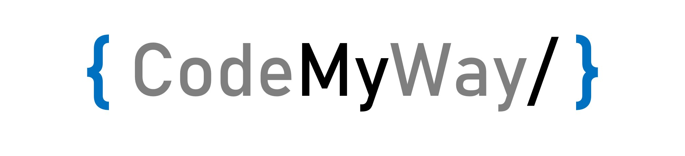

<h1> Hello, Aashay here 👋 </h1>

Founder of <a href="https://github.com/aashaypawar#:~:text=what%20is%20codemyway?">CodeMyWay</a> and a Backend Developer
 
I am an AI enthusiast and love developing Native Android Apps (in Kotlin💘).
  
<h3> Languages and Tools 💻 </h3>

  
  
  
  
  
  
  
  
  
  

 
<h3> Writing Samples 📚</h3>
<ul>
  <li><a href="https://auth.geeksforgeeks.org/user/aashaypawar/articles">GeeksforGeeks</a> 57 articles</li> 
  <li><a href="https://scholar.google.com/citations?user=9UwnRSgAAAAJ&hl=en">Google Scholar</a> 4 IEEE conferences</li>
</ul>
 
<h3> What is CodeMyWay?</h3>

CodeMyWay is a non-profit organization that runs multiple campaigns to help our community understand and implement the technology. We run the "Uplift" program to provide two month internships to students and professionals who are willing to pursue or change their field to Data Science, AI, ML, Mobile Development, Website Development and other non-technical fields such as marketing and content developing. <a href="">Support us</a>.
    
Thanks for visiting ❤️

Last updated on 15/5/21 21:50

